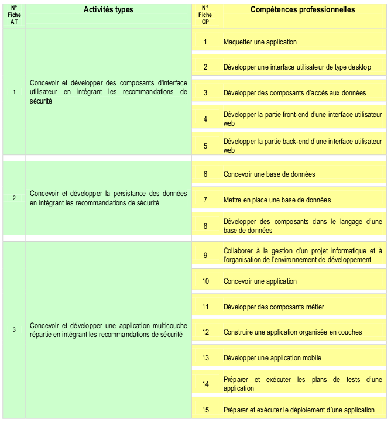

<h1 align="center">Naima TOURAGHE 
  
</h1>

<h3 align="center">Conceptrice Développeuse d'Application DevOps - BAC+3</h3>
<h4 align="center">Recherche alternance du 6 mars 2023 au 6 septembre 2024</h4>
<h6 align="center">3 semaines en entreprise, 1 semaine en formation</h6>
 

Suite à la validation d'un bac +2 en développement Web et Web Mobile, j'ai poursuis ma formation en `bac+3` dans le cursus en `Conception et Développement d'Applications DevOps` proposé par Simplon.

Je suis en recherche active d'une entreprise ayant d'une part un environnement `AGILE` et `DEVOPS` et d'autre part des projets nécessitant des compétences en conception. 

<h4 align="left">Mes applications d'algorithmique</h4>

 

<h4 align="left">Technologies utilisées en projet (professionnels, pédagogique ou personnel) :</h4>

<code></code>
<code></code>
<code></code>
<code></code>
<code></code>
<code></code>
<code></code>
<code></code>
<code></code>
<code></code>
<code></code>

<h4 align="left">Technologies au programme cette année:</h4>
<code></code>
<code></code>
<code></code>
<code></code>

<h4 align="left">Les blocs de compétences associés à la certification "Concepteur Développeur d'applications DevOps":</h4>

